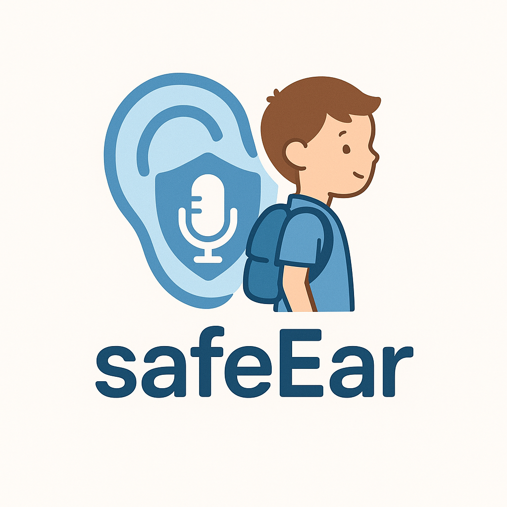
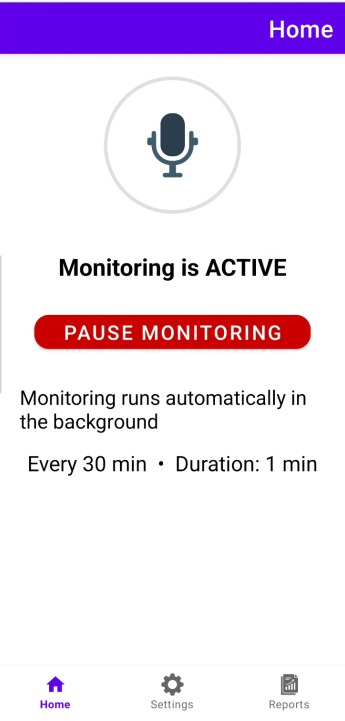
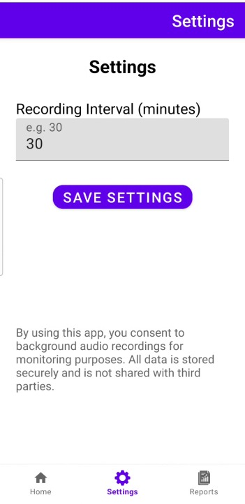
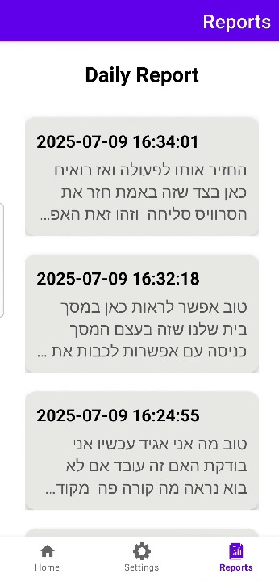

<p align="center">
  
</p>

# SafeEar 👂📱
**An Android app for ambient voice monitoring and transcription — built for concerned parents.**

---

## 🧠 What is SafeEar?

**SafeEar** is a background audio monitoring app designed for parents of young children.  
It records the ambient environment near the child for **1 minute every 30 minutes**, automatically transcribes the audio to **text** using Google's Speech-to-Text API, and stores it securely for parental review.

🛡 This app was inspired by recent alarming reports of bullying, abuse, or neglect occurring in schools and kindergartens. SafeEar offers a **non-invasive**, **passive**, and **secure** solution to help parents gain insights into their child's environment — directly from their phone.

---

## ✨ Features

- 🔄 Records background sound every **30 minutes**, for **1 minute**
- 🎙 Converts audio to **text (transcription)** using **Google Speech-to-Text**
- 🔐 Stores transcriptions locally and securely (using SharedPreferences)
- 📋 Presents past transcriptions as a **Daily Report**
- 🔔 Runs silently in the background using a **Foreground Service**
- 🔧 Adjustable recording interval (duration is fixed)
- ✅ Supports Hebrew (he-IL) and other languages
- 📱 Simple UI with Home, Settings, and Report screens

---

## 📲 Screens Overview

### 🏠 Home Screen


- Displays whether monitoring is **active or paused**
- Lets user toggle monitoring ON/OFF
- Shows current settings (interval + duration)

---

### ⚙️ Settings Screen


- User can define how frequently to record (in minutes)
- Example: record every 30 minutes for 1 minute
- Settings are saved instantly and affect the running service in real-time

---

### 📄 Daily Report Screen


- Shows transcribed text logs, sorted by time
- Each log contains:
  - 🕒 Timestamp
  - 📄 Transcription content
- These logs are never shared externally and only exist on the device

---

## 🔐 Microphone Permission & Privacy

**Why does the app require microphone access?**

> To record the surrounding audio of the child for transcription purposes. The data is never uploaded or shared.

**Privacy Guidelines:**

- ✅ Audio recordings are never stored permanently — they're deleted after processing
- ✅ Transcriptions are stored in a **private storage area**, not accessible to other apps
- ✅ No external server communication is involved (except Google Speech API)
- ✅ The API Key is stored securely in the build system (not hardcoded)

This app fully complies with Android's [permissions policy](https://developer.android.com/guide/topics/permissions/overview) and best practices.

---

## 🛠 How It Works (Technical Flow)

### 1. `MonitoringService.java`
- Background service running continuously in the foreground
- Triggers recording every X minutes based on user settings

### 2. `AudioRecorderHelper.java`
- Records 1 minute of audio using `AudioRecord`
- Saves the file in `.wav` format for compatibility with Speech API

### 3. `SpeechToTextHelper.java`
- Encodes the audio in Base64
- Sends it via HTTP POST to Google’s `speech:recognize` endpoint
- Parses and returns the transcribed text (in Hebrew)

### 4. `SharedPreferences`
- Transcriptions are saved as key-value pairs:
  - Key: `report_2025-07-09 14:35:22`
  - Value: `"I don’t want to play with you..."`

---

## 🔧 API Key Management (Best Practice)

The API key is stored securely using `local.properties` (never hardcoded):

1. Add this to your **`local.properties`** (not under version control):
   API_KEY=your_actual_google_api_key
2. In `build.gradle.kts`:
```kotlin
defaultConfig {
    val properties = Properties()
    properties.load(project.rootProject.file("local.properties").inputStream())

        buildConfigField(
            "String",
            "API_KEY",
            "\"${properties.getProperty("API_KEY")}\""
        )
}
```
3. In code
   ```java
   BuildConfig.API_KEY
    ```
   ✅ This method ensures security, avoids API abuse, and aligns with best practices.
   BuildConfig.API_KEY

   ---

## 📦 Tech Stack

- 📱 Android SDK 35  
- 🎙 AudioRecord API (native)  
- 🧠 Google Cloud Speech-to-Text (REST API)  
- 💾 SharedPreferences  
- 🧩 RecyclerView  
- 🔒 Foreground Service + Notification Channel  
- 🛠 Kotlin DSL for Gradle  
- 💡 ViewBinding  
- 🧪 JUnit, Espresso  

---

## 🚀 Usage Recommendations

- The app should be used responsibly and ethically.  
- Intended for parents or legal guardians to monitor minors for safety.  
- Should not be used to violate privacy in public or unauthorized environments.  

---
## 🙏 Final Words

SafeEar was developed to empower parents with better tools to protect their children in environments where they may not always be present.  
Our goal is to bring peace of mind and to use technology **for good**. 💜

---
## **Authors**

- [Gal Deri](https://github.com/galDeri23)
